# PowerPoint Generator - System Architecture Diagrams

This document provides visual representations of the PowerPoint Generator system architecture using Mermaid diagrams.

## System Overview Diagram

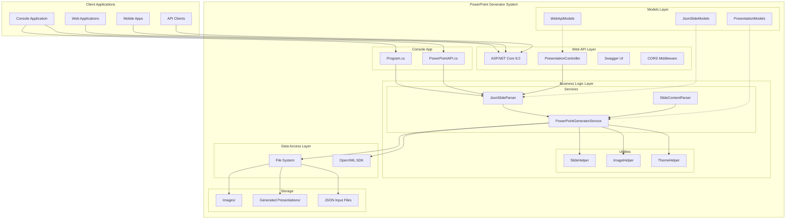

## Detailed API Data Flow

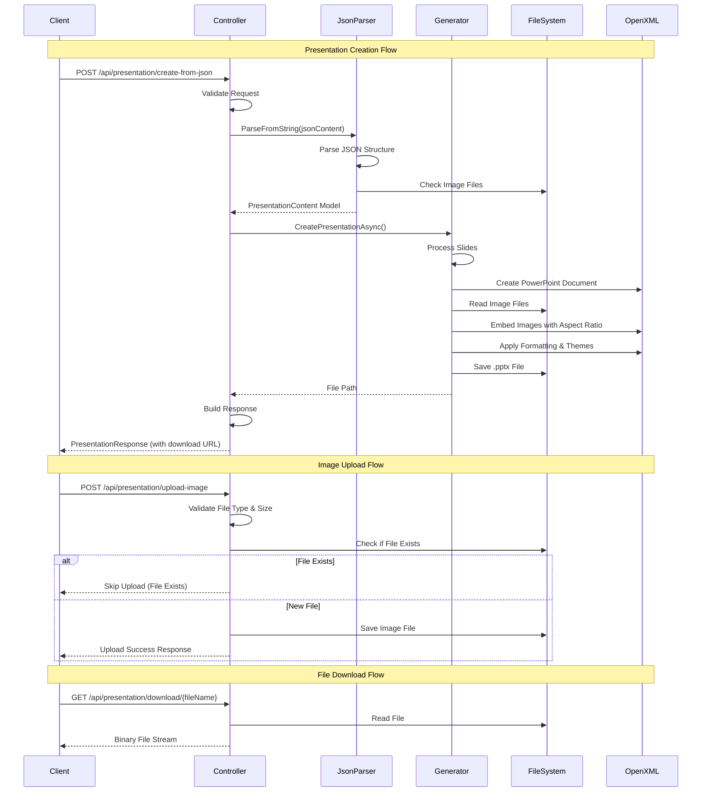

## Console Application Flow

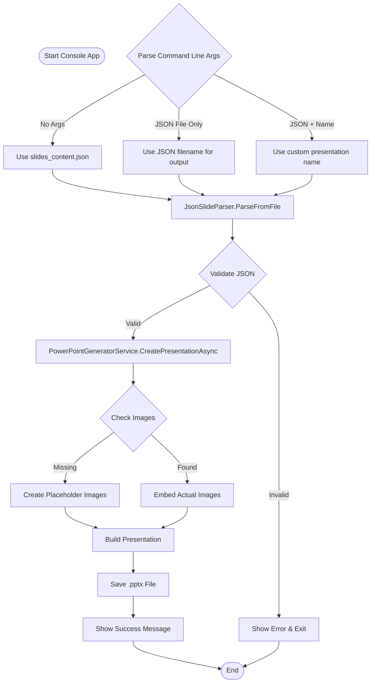

## Current File Structure

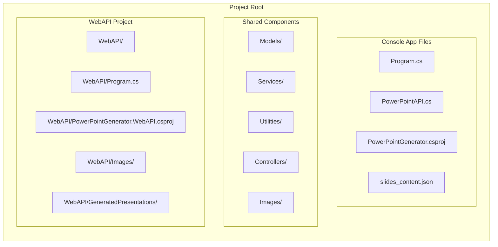

## Deployment Architecture Options

### Option 1: Single Server Deployment

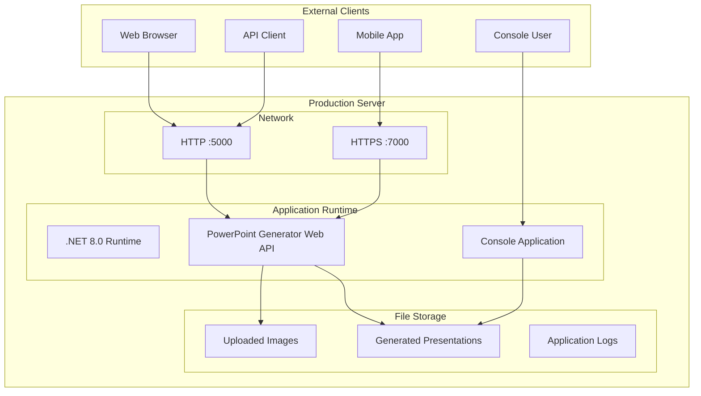

### Option 2: Containerized Deployment

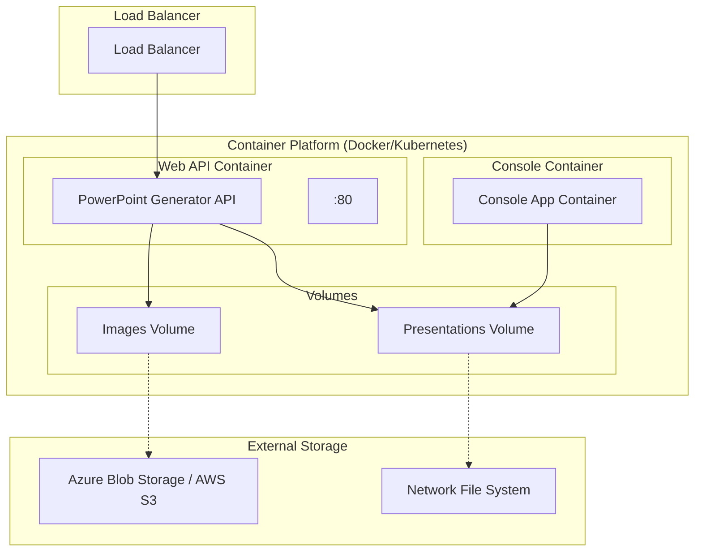

### Option 3: Cloud Native Architecture

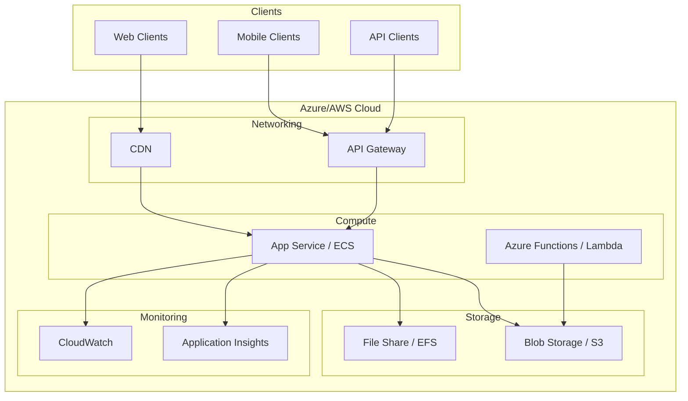

## Security Architecture

### Current Security Model

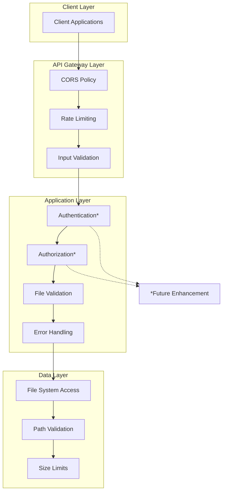

### Future Security Architecture

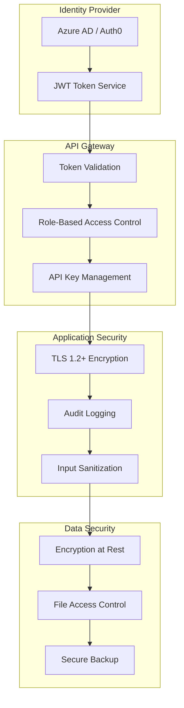

## Technology Stack Diagram

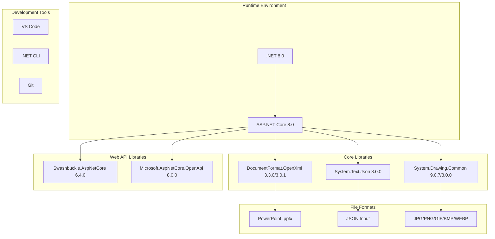

## System Startup Flow

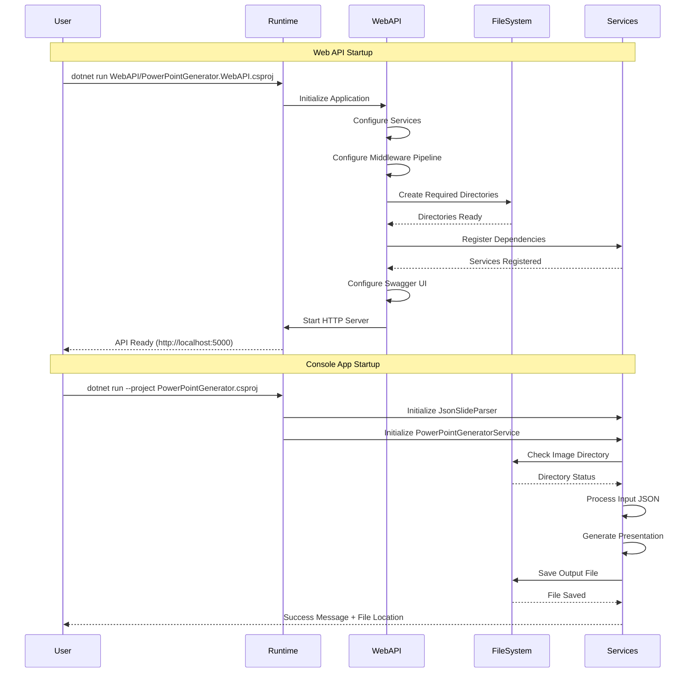

This comprehensive set of diagrams provides visual documentation for all aspects of the PowerPoint Generator system architecture, from high-level system overview to detailed deployment scenarios and security models.
