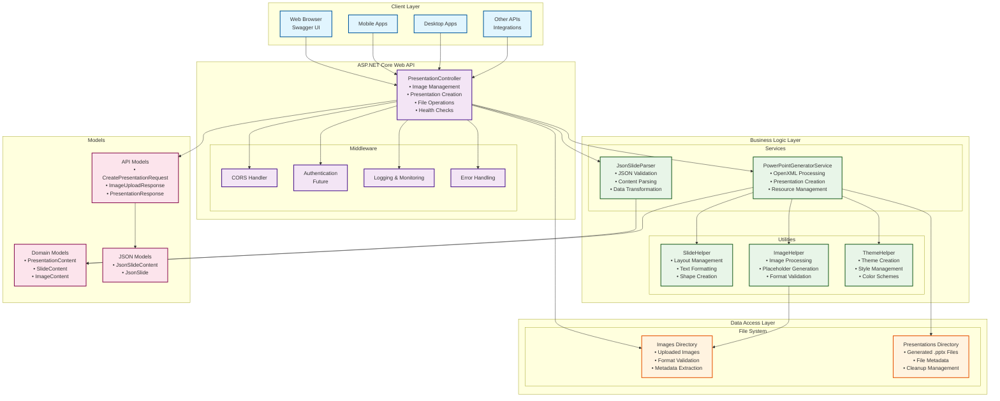
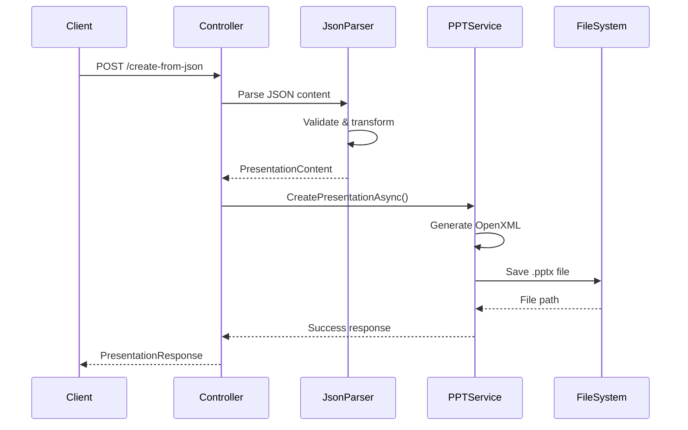
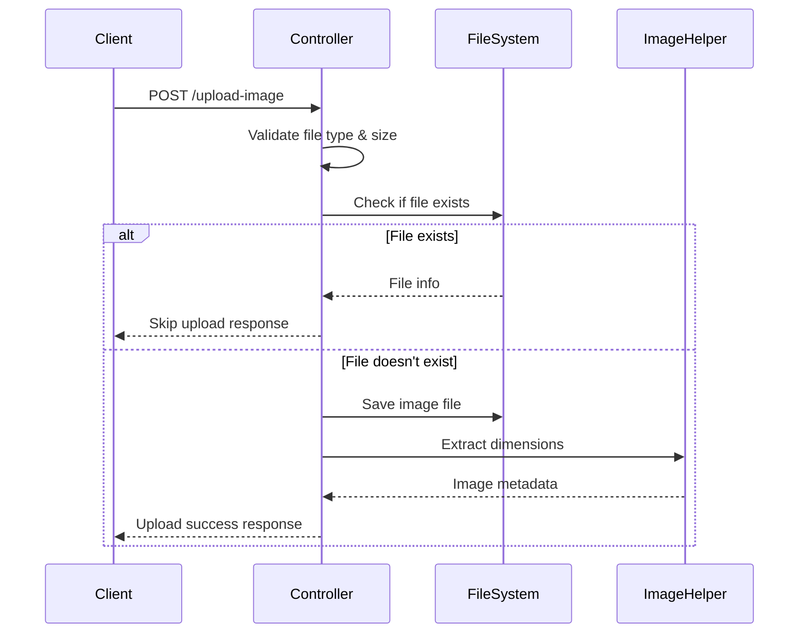
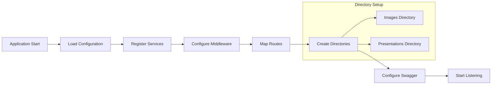
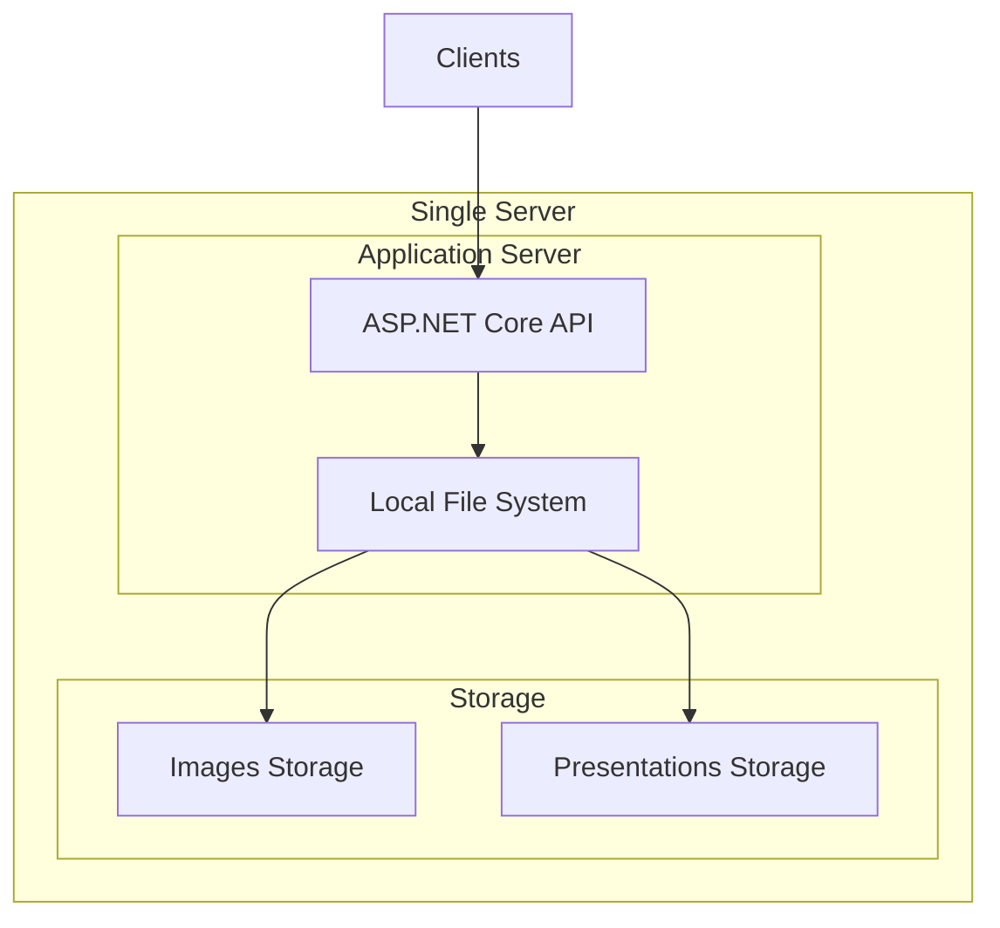
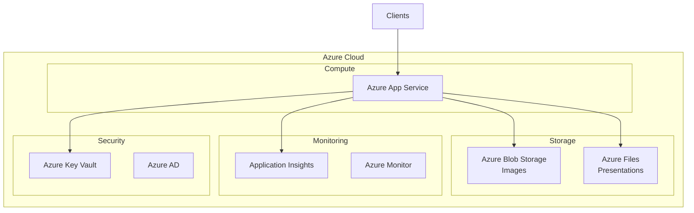
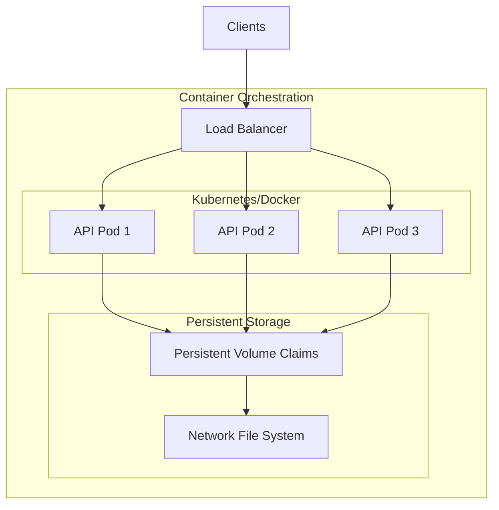
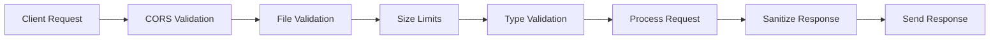
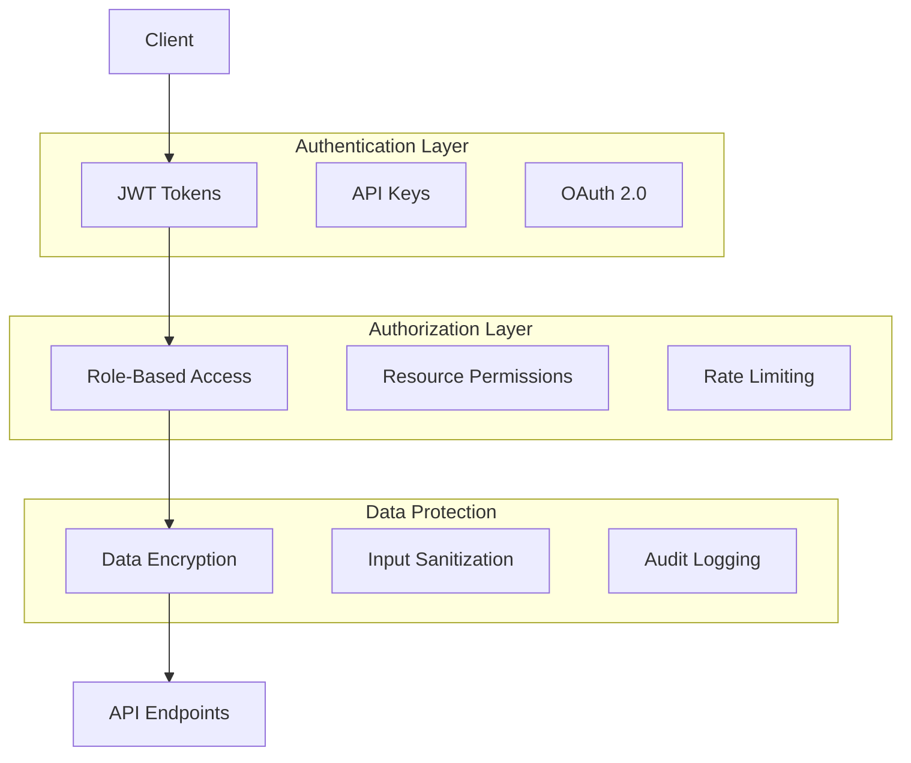

# PowerPoint Generator - System Architecture Diagram

## Component Relationship Diagram

## Data Flow Diagrams

### 1. Presentation Creation Flow

### 2. Image Upload Flow

### 3. System Startup Flow

## Deployment Architecture Options

### Option 1: Single Server Deployment

### Option 2: Cloud Deployment (Azure)

### Option 3: Containerized Deployment

## Security Architecture

### Current Security Model

### Future Security Enhancements

This comprehensive architecture documentation provides both high-level system design and detailed component relationships for your PowerPoint Generator web service.
